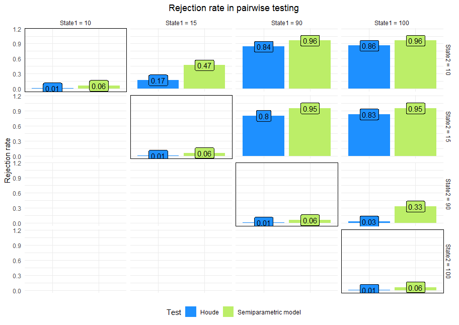

# Testing procedure

We propose a novel test based on semiparametric mixed model regularized by ridge regression for HDX-MS data. The test is meant for a specifically designed experiment in which each replication was a sample prepared by incubation of the protein stock (at a particular biological state) in the labeling solution for various time-points i.e. 0s (control), 10 s, 60 s, etc. Thus, under the term \textit{replication} we understand a single deuterium uptake curve consisting of deuterium uptake observed over time as shown on the plot below.

```{r , echo=FALSE, out.width = '100%'}
# knitr::include_graphics("du.pdf")
```

The semiparametric test is dedicated for the assessment of the differences in deuteration levels between different biological states. We present an example data set below.

```{r , echo=FALSE, out.width = '100%'}
# knitr::include_graphics("du.pdf")
```

The model requires the following data:

* Deuterium uptake (response) - calculated from spectrum
* Exposure time
* Biological state
* Replication ID

When the differences emerge to be meaningful, it is a basis for the assumption that changing the biological state affected the structural factors of the protein. The testing problem can be written down using the following hypotheses:

*$H_0$: The deuterium uptake does not differ between states. (The peptides have the same protection level).*

*$H_1$: The deuterium uptake differs between states.  (The peptides differ in respect of the protection level).*


We describe the testing procedure applied in the semiparametric test in detail in four steps:

## Step 1: Regression spline

The regression spline is an extension of the linear approach that allows for nonlinear relationship between response and the features. Such a model for the response $Y$ along with predictors $X_1, \ldots, X_p$ can be represented by the following formula:

$$y_i = \beta_0 + \sum_{j = 1}^p f_j(x_{ij}) + \epsilon_i$$

where $f_j$, $j = 1, \ldots, p$ are smooth (nonlinear) functions. The semiparametric part of our model is a spline based on the simplest base functions $f$, so called truncated lines. Namely, for $y$ denoting deuteration level and $x_T$ denoting exposure time we have 

$$y_i = \beta_0 + \beta_1 x_{Ti} + \sum_{k = 1}^{K} u_k (x_{Ti} - \kappa_k)_+$$

where $u_k$ for any $k = 1, \ldots, K$ are coefficients corresponding to $k^{th}$ truncated line (exposure time) and for any $x, a \in \mathbb{R}$ we define  $$(x - a)_+ = \max(0, ~x - a).$$

We create the design matrix $\mathbf{X}$ for all the time points as follows
$$
\mathbf{X} = \begin{pmatrix}
(x_1 - \kappa_1)_+ & \dots & (x_1 - \kappa_K)_+\\
\vdots & &\vdots \\
(x_n - \kappa_1)_+ & \dots & (x_n - \kappa_K)_+
\end{pmatrix}
$$
and go to step 2.

## Step 2: Regularization by ridge regression

We use $l_2$-norm penalized regression to select columns of $\mathbf{X}$. To do so, we fit ridge regression model with response $Y$ (deuterium uptake) and abovementioned design matrix $\mathbf{X}$, by solving the formula:

$$\hat{\beta}_{ridge} = \underset{b \in \mathbb{R}^p}{\arg\min}~\bigg\lbrace||Y - Xb||^2 + \lambda \sum_{i = 1}^p b_i^2\bigg\rbrace$$


where $\lambda$ is the regularization penalty. Let us notice that the greater value of $\lambda$ we set, the sparser estimator of $\beta$ we obtain. At the same time, the sparser estimator of $\beta$ we get, the fewer knots we select to the spline and the more 'boxy' the target model will be.

```{r , echo=FALSE, out.width = '100%'}
# knitr::include_graphics("plot_sline.pdf")
```


We denote the set of chosen knots (time points) as $\kappa_{ridge}$, and consequently the semiparametric part of the model as 
$$\sum_{\kappa \in \kappa_{lasso}} u_\kappa (x_{Ti} - \kappa)_+$$
and go to step 3.

## Step 3: Final model

The starting point of our model is a simple linear model with an interaction term:

$$y_i =  \beta_0 + \beta_T x_{Ti} + \beta_S x_{iS} + \beta_{TS}x_{Ti}x_{Si}+ \epsilon_i$$

Since the considered data has a longitudinal characteristic, it is desirable to fit a model with random effects as well \parencite[see][]{10.1093/ansci/1973.Symposium.10}. We use the function \texttt{lmer} from the R-package $lmerTest$ and fit spline model with two random intercepts - one varying across different curves ($b_{id}$) and second across different time points ($b_T$). Next, we add penalized semiparametric part and obtain the final model:

$$y_i =  \beta_0 + b_{id} + b_{T}  + \beta_T x_{Ti} + \beta_S x_{iS} + \beta_{TS}x_{Ti}x_{Si}+ \sum_{\kappa \in \kappa_{ridge}} u_\kappa (x_{Ti} - \kappa)_+ + \epsilon_i$$

where $x_S$  denotes protein state.

## Step 4: Testing

Comparing the differences in deuteration levels in the case of the model-based approaches comes down to determining whether the state indicator is dependent on the measurement of masses. In other words, we test whether the variable describing the protein state should be selected for the model. It can be done via the F test in the context of nested models comparison. In the case of comparing the fixed parts of mixed models, we use the analogous version of the F-test extended by Satterthwaite's method for computing the denominator degrees of freedom and F-statistics as proposed in \parencite[Appendix A]{kuznetsova2017lmertest}. The method is available in the package $lmerTest$ as it provides us with the method $anova$ for mixed models.


# Results

To assess the performance of our test we provided a benchmark with community recognized Houde test for HDX-MS data analysis. \parencite{houde2011utility}. We simulated data of 72 peptides at different biological states. The analysis of rejection rate in the pairwise testing procedure at the significance level 0.05 showed that the type I error (false positives) of semiparametric test does not surpass 0.06 while its power (true positives) is greater, when compared to others, even about 0.6 in the tough cases when the actual differences are small.

```{r , echo=FALSE, out.width = '100%'}

```

The spline models are not as exposed to the impact of outliers as other model-based tests because of their local characteristics. As distinct from Houde they are capable of modeling the deuterium uptake well along the time taking into account its variability which makes them more sensitive in discriminating between different biological states and causes appreciable outperformance. 
